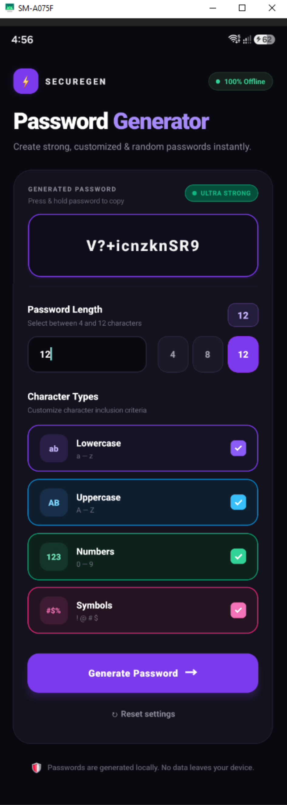

# ⚡ SECUREGEN — React Native Password Generator

<p align="center">
  
</p>

<p align="center">
  <b>A sleek, ultra-modern dark themed React Native application designed to generate strong, secure, and customizable random passwords 100% offline.</b>
</p>

<p align="center">
  <a href="#-key-features">Key Features</a> •
  <a href="#-app-preview">App Preview</a> •
  <a href="#-tech-stack">Tech Stack</a> •
  <a href="#-getting-started">Getting Started</a> •
  <a href="#-project-structure">Project Structure</a>
</p>

---

## ✨ Key Features

- 🛡️ **100% Offline & Private**: All passwords are generated locally on your device. Zero data leaves your phone.
- 🎨 **Ultra-Modern Dark UI**: Designed with a deep void aesthetic (`#0A0911`), vibrant neon accents, glassmorphic card elevation, and smooth micro-interactions.
- ⚡ **Dynamic Strength Evaluator**: Real-time password strength meter (**Ultra Strong**, **Strong**, **Medium**, **Weak**) based on password length and selected character sets.
- 🎛️ **Customizable Character Sets**:
  - 💜 **Lowercase** (`a-z`)
  - 💙 **Uppercase** (`A-Z`)
  - 💚 **Numbers** (`0-9`)
  - 💗 **Symbols** (`!@#$%^&*+?>/`)
- 📏 **Length Control & Presets**: Choose any password length between **4 and 12 characters**, with instant quick-preset chips (`4`, `8`, `12`).
- 📋 **Tap / Long Press to Copy**: Native selectable password display container.
- ⌨️ **Keyboard Avoidance**: Integrated `KeyboardAvoidingView` ensuring zero layout overlap when the virtual keyboard opens.
- 📋 **Formik & Yup Validation**: Robust form state management and input schema validation.

---

## 🛠️ Tech Stack & Dependencies

- **Framework**: [React Native](https://reactnative.dev/) (v0.87.1) with [React 19](https://react.dev/)
- **Language**: [TypeScript](https://www.typescriptlang.org/) (v6.0.3)
- **Form Management**: [Formik](https://formik.org/) (v2.4.9)
- **Validation Schema**: [Yup](https://github.com/jquense/yup) (v1.7.1)
- **Custom UI Components**: [react-native-bouncy-checkbox](https://github.com/WrathChaos/react-native-bouncy-checkbox) (v4.1.4)
- **Layout Safety**: [react-native-safe-area-context](https://github.com/th3rdwave/react-native-safe-area-context) (v5.5.2)

---

## 🚀 Getting Started

### Prerequisites

Ensure you have installed:
- **Node.js**: `>= 22.11.0`
- **npm** or **yarn**
- **Android Studio** (for Android Emulator/Build) or **Xcode** (for iOS Simulator, macOS only)
- **JDK 17+**

### Installation

1. **Clone the Repository**:
   ```bash
   git clone https://github.com/imtiazaly/Password-Generator-App-React-Native.git
   cd Password-Generator-App-React-Native
   ```

2. **Install Dependencies**:
   ```bash
   npm install
   ```

3. **Start the Metro Bundler**:
   ```bash
   npx react-native start
   ```

4. **Run on Android**:
   ```bash
   npx react-native run-android
   ```

5. **Run on iOS** (macOS only):
   ```bash
   cd ios && bundle exec pod install && cd ..
   npx react-native run-ios
   ```

---

## 📁 Project Structure

```text
Password-Generator-App-React-Native/
├── assets/
│   └── images/
│       └── passgen.PNG         # Application preview screenshot
├── App.tsx                     # Main App component with UI & Password Logic
├── index.js                    # Application entry point
├── app.json                    # React Native app configuration
├── package.json                # Project dependencies and scripts
├── tsconfig.json               # TypeScript configuration
└── README.md                   # Project documentation
```

---

## ⚙️ How It Works

1. **Length Validation**: The user selects a password length (between 4 and 12). Formik validates the input using the `Yup` schema:
   ```typescript
   const PasswordSchema = Yup.object().shape({
     passwordLength: Yup.number()
       .min(4, 'Password must be at least 4 characters')
       .max(12, 'Password cannot exceed 12 characters')
       .required('Password length is required'),
   });
   ```
2. **Character Pool Construction**: Based on enabled toggle switches (Lowercase, Uppercase, Numbers, Symbols), a character pool is dynamically compiled.
3. **Random Generation**: Characters are picked randomly using standard math random indexing up to the selected length.
4. **Strength Rating**: Evaluates complexity dynamically based on character variety and string length.

---

## 📄 License

This project is open-source and available under the [MIT License](LICENSE).
